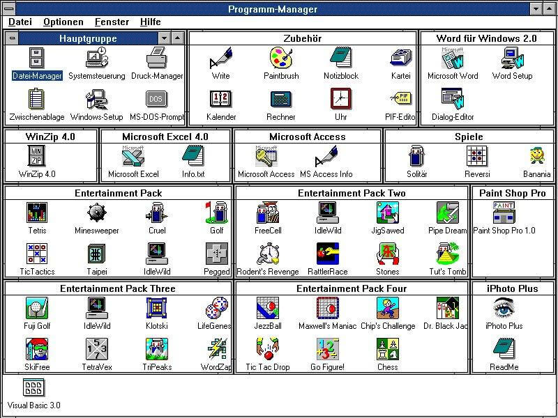
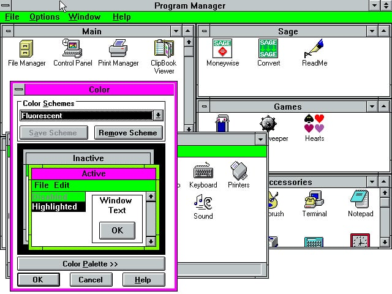
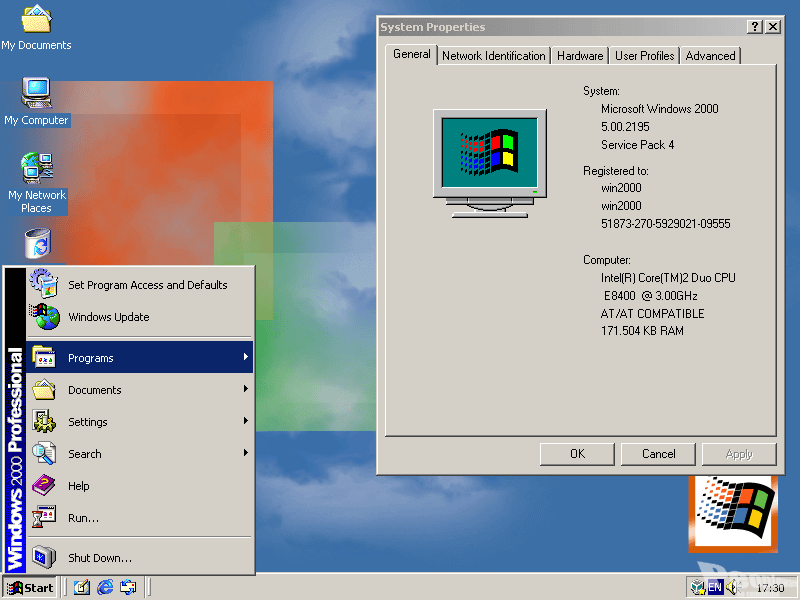
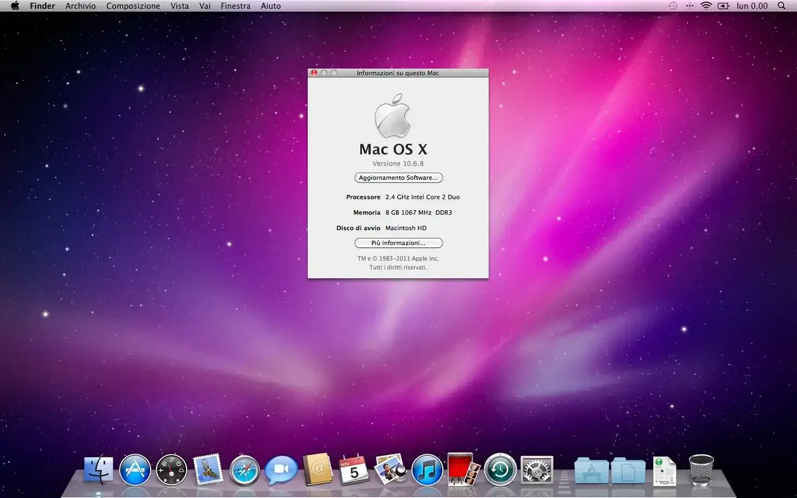
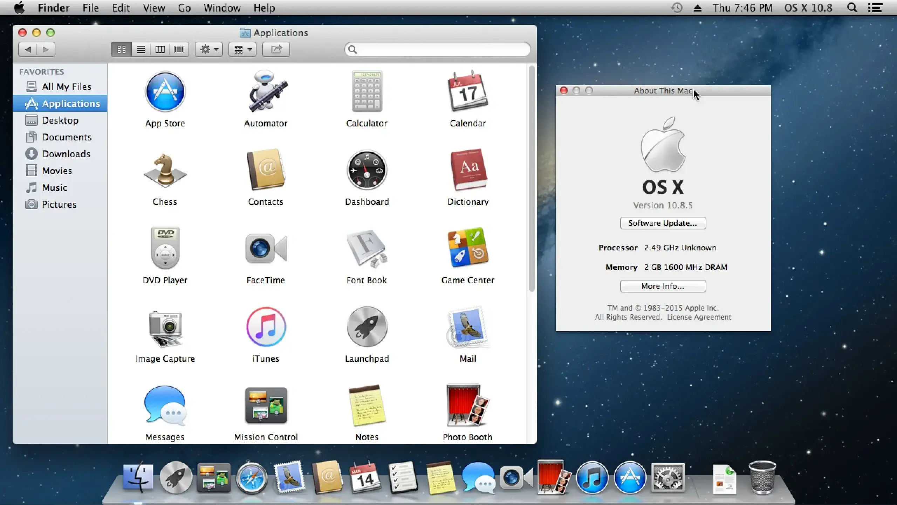
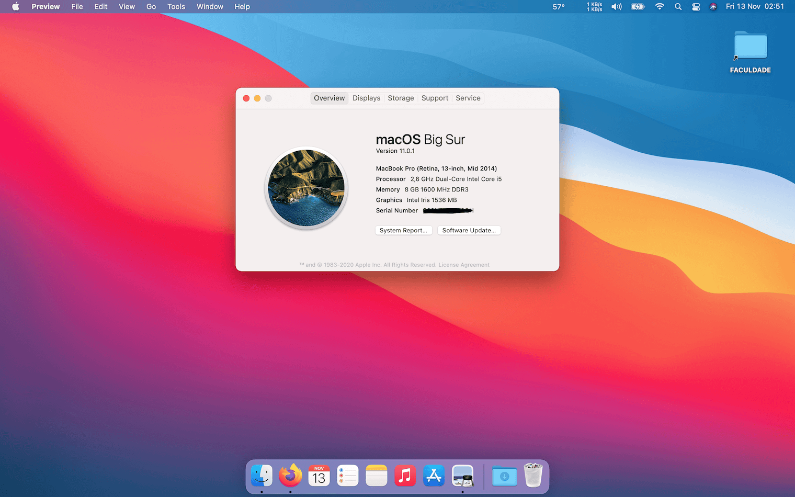

# Evolução dos sitemas operativos

## Microsoft Windows:

- ### Windows 1.0 (1985):

  

  #### Características principais:

  - Primeira interface gráfica do utilizador (GUI) baseada em janelas. Uma substituição do MS-DOS puro, mas ao mesmo tempo o SO era executado sobre o MS-DOS;
  - Suporte do rato pela primeira vez que também permitia operações "click-and-drag";
  - Aplicações básicas: Bloco de Notas, Paint, Calculadora, Relógio e Terminal;
  - Multitasking limitado;
  - O sistema operativo não permitia que as suas janelas se sobrepusessem e, em vez disso eram distribuidas em mosaico;
  - Sistema de arquivos FAT12;

- ### Windows 2.0 (1987):

  

  #### Características principais:

  - Suporte para janelas sobrepostas e redimensionamento das mesmas;
  - Suporte para atalhos de teclado(CTRL+C, CTRL+V, etc..) e gráficos melhorados para 16 cores;
  - Introdução das aplicações Microsoft Word e Excel;
  - Melhorias na gestão de memória;

- ### Windows 3.0 (1990):

  

  #### Características principais:

  - GUI significamente melhorado, introdução dos icones coloridos;
  - Maior suporte de hardware multimedia, possibilidade de gravar e reproduzir o som, suporte de CD-ROMs;
  - Melhorias na gestão de memória;
  - Introdução do Gestor de Programas e Gestor de Ficheiros;

- ### Windows 3.1 (1992):

  

  #### Características principais:

  - GUI significamente melhorado, introdução dos icones coloridos;
  - Maior suporte de hardware multimedia, possibilidade de gravar e reproduzir o som, suporte de CD-ROMs;
  - Melhorias na gestão de memória;
  - Introdução do Gestor de Programas e Gestor de Ficheiros;
  - Em 1992 saiu uma atualização que permitia ligar os computadores em rede P2P;

- ### Windows NT 3.x (1993):

  

  #### Características principais:

  - Orientado somente para setor empresarial. Sua libertação para setor domestico so foi possivel com lançamento do Windows XP;
  - Introdução do kernel de 32 bits;
  - Introdução do sistema de arquivos NTFS;
  - Introdução do multi-utilizador;
  - Suporte dos protocolos de rede;
  - Maior e melhor segurança e estabilidade do SO;

- ### Windows 95 (1995):

  

  #### Características principais:

  - GUI revolucionário com introdução do menu "Iniciar";
  - Introdução da barra de tarefas juntamnete com o botão "Iniciar";
  - Introdução da arquitetura de 32-bits e do suporte para "plug-and-play";
  - Internet Explorer integrado;
  - Introdução inicial de USB, mas suporte era limitado exigia drivers específicos para cada dispositivo;
  - Introdução do sistema de arquivos FAT16;

- ### Windows 98 (1998):

  

  #### Características principais:

  - Melhor integração com a internet e multimédia;
  - Introdução de suporte nativo para USB;
  - Introdução da arquitetura de 32-bits e do suporte para "plug-and-play";
  - Introdução da aplicação Windows Media Player;
  - Introdução do sistema de arquivos FAT32;

- ### Windows 2000 (2000):

  

  #### Características principais:

  - Orientado mais para empresas e servidores;
  - Maior segurança e estabilidade;
  - Melhor gestão de rede;
  - Suporte de sistema de arquivos NTFS;

- ### Windows ME (Millenium Edition) (2000):

  

  #### Características principais:

  - Orientado mais para utilizadores domésticos;
  - Introdução da ferramenta Restauração do Sistema;
  - Introdução da aplicação Windows Movie Maker e melhorias no Windows Media Player;
  - Tinha problemas com estabilidade;

- ### Windows XP (2001):

  

  #### Características principais:

  - Esta versão marca a unificação das linhas de produtos Windows para uso doméstico e empresarial. As próximas versões do Windows seguirão o mesmo formato, com edições específicas para cada setor;
  - GUI completamnete reformulado com um design moderno e ntuitivo;
  - Melhorias significativas no desempenho e estabilidade. Sistema foi construido sobre o nucleo do Windows NT;
  - Melhorias significativas na conectividade. Introdução dos WI-FI e Ethernet;
  - Melhorias do Windows Media Player. Suporte para gravação de CDs e DVDs, edição multimedia;
  - Suporte aprimorado para hardware e software;
  - Introdução das atualizações automaticas;
  - Em 2005 saiu uma versão de 64-bit;

- ### Windows Vista (2007):

  

  #### Características principais:

  - Introdução da nova GUI Windows Aero que apresentou uma evolução visual aos anteriores versões;
  - Melhorias na pesquisa e gestão de arquivos;
  - Melhorias na segurança: introdução do Windows defender, BitLocker e UAC(User Accaunt Control);
  - Sitema era bastante "pesado" e exigia muito do hardware, causando bastantes críticas;

- ### Windows 7 (2009):

  

  #### Características principais:

  - GUI Windows Aero mais refinado;
  - Desempenho bastante melhorado em comparação com a versão anterior(Vista);
  - Melhorias no suporte para ecrãs "Touch Screen";
  - Melhorias no suporte de SSDs;
  - UAC(User Accaunt Control) tornou-se mais amigável e Windows Defender;
  - Windows 7 é considerado por muitos utilizadores como o melhor SO da Microsoft;

- ### Windows 8 (2012):

  

  #### Características principais:

  - Introdução do GUI "Metro", com foco em dispositivos com ecrãs táteis;
  - Remoção do Menu Iniciar. Decisão controversa que causou bastante discussão na comunidade;
  - Maior integração com "nuvens"(Clouds);
  - Melhorias no desempenho: arranque mais rapido e menor consumo;
  - Melhorias na conectividade: supore de USB 3.0 e integração com serviços online da MS;

- ### Windows 8.1 (2013):

  

  #### Características principais:

  - Esta versão é considerada uma autalização da versão 8, que por sua vez trouxe correções e melhorias da versão anterior;
  - Retorono do botão Iniciar devido a muitas criticas na versão anterior;
  - Desempenho e Multi-tasking melhorados;
  - Integração com o motor de pesquisa Bing;
  - Suporte melhorado para múltiplos monitores;

- ### Windows 10 (2015):

  

  #### Características principais:

  - Unificação entre PC e dispositivos moveis;
  - Retorno do Menu Iniciar, mas reinventado. Cobinação entre o estilo do menu classico e telas dinamicas vindas do Windows 8;
  - Introdução do Microsoft Edge e Cortana;
  - Suporte para múltiplos desktops virtuais;
  - Desenvolvimento de aplicações universais que funcionam em diferentes dispositivos(PCs, smartphones,tablets);
  - Integração com Xbox Live;

- ### Windows 11 (2021):

  

  #### Características principais:

  - Novo GUI moderno e minimalista;
  - Foco geral em produtividade;
  - Menu Iniciar centralizado;
  - Maior compatibilade com aplicações Android;
  - Grandes melhorias múltiplos desktops virtuais;
  - Integração com ecossistema MS: MS Teams, Xbox Game Pass, Aplicações Android na MS Store;
  - Bastantes melhorias em desempenho e segurança;

## Apple Mac OS:

- ### Classic System Mac OS (1984-2001):

   | 
  

   |  

  Primeira versão: **System 1.0 (1984)** | Última versão: **Mac OS 9 (1999)**

  #### Características principais:

  - Interface Gráfica do Utilizador (GUI): Introdução de uma GUI orientada pelo rato com ícones, janelas e menus;
  - Sem suporte ao Terminal: Ao contrário do MS-DOS e do Unix, não tinha uma interface de linha de comandos, centrando-se apenas na GUI;
  - Sistema Operacional com código-fonte fechado;
  - Orientado para mercado domestico;
  - Sem suporte Mutli-tarefas: As primeiras versões só podiam executar uma aplicação de cada vez;
  - Multitasking Cooperativo: introduzido em System 5, mas era instável;
  - Extensões e Painéis de Controlo: Personalização através de extensões do sistema, levando a conflitos e instabilidade;
  - Mac OS 9: Na última versão do Mac OS Clássic, foram introduzidas funcionalidades como o suporte multi-utilizador e a proteção de memória baseada em software.

- ### Mac OS X (2001-2012):

   | 
  

   |  

  Primeira versão: **Mac OS X 10.0 "Cheetah" (2001)** | Última versão: **Mac OS 10.8 "Mountain Lion" (2012)**

  #### Características principais:

  - Interface Gráfica AquaUI: Apresentou um design elegante e translúcido com animações e sombras projetadas;
  - SO baseada no Unix: Construída sobre um kernel Unix, oferecendo maior estabilidade, segurança e desempenho em comparação com as versões anteriores do Mac OS;
  - Intodução do Terminal;
  - Multitarefa preventiva: permitiu execução das multitarefas mais suave em comparação com o Mac OS clássico;
  - Introdução do Dock e Exposé: Dock permitia ter acesso rapido as aplicações de qualquer lugar, Exposé permitia visualizar e gerir todas as janelas abertas de uma aplicação em especifico, ou de todas as janelas no geral;
  - Introdução do Quartz: motor grafico 2D para renderização de açta qualidade de graficos de texto;
  - Intordução do OpenGL: suporte para gráficos 3D avançados, impulsionando jogos e aplicações de design;
  - Integração com IOS: funcionalidades como o iCloud, Launchpad e Mac App Store preencheram a lacuna entre o Mac e o iOS;
  - Transição para CPUs da Intel que ajudou melhor performance dos seus computadores;

- ### OS X (2012-2016):

   | 
  

  Primeira versão: **OS X 10.9 "Mavericks" (2013)** | Última versão: **OS 10.11 "El Capitan" (2015)**

  #### Características principais:

  - Rebranding: "Mac OS X" foi renomeado para "OS X", refletindo a sua evolução moderna;
  - Desempenho e Eficiência: Foco em otimizar o desempenho e a eficiência energética, com tecnologias como Compressed Memory (para compactar dados na RAM) e Timer Coalescing (para reduzir o consumo de energia);
  - Introdução das atualizações gratuitas: a Apple deixou de cobrar pelas atualizações do SO a partir da versão Mavericks;
  - Integração com o iOS: Recursos como o Centro de Notificações, iMessage, Lembretes e Notas foram trazidos do iOS para o Mac, proporcionando uma experiência mais consistente entre os dispositivos da Apple;

- ### macOS (2016-Presente):

   | 
  

   |  

  Primeira versão: **macOS X 10.12 "Sierra" (2016)** | Corrente versão: **macOS 14 "Sonoma" (2015)**

  #### Características principais:

  - Rebranding para "macOS": alinhamento com outras convenções de nomenclatura de sistemas operativos da Apple (iOS, watchOS, tvOS);
  - Introdução do Siri no macOS;
  - Introdução do Modo Escuro;
  - Transição para CPUs de fabrico próprio Apple M1/M2/M3, melhorando a eficiência, a duração da bateria e o desempenho.;
  - Introdução do APFS: sistema de arquivos da Apple foi introduzido, oferecendo melhor desempenho, segurança e confiabilidade;
  - Integração mais profunda com o iOS: funcionalidades como o Universal Control, Sidecar (iPad como segundo ecrã) e melhorias no AirDrop;
  - Fim do iTunes: O iTunes foi substituído por aplicações dedicadas para música, podcasts e TV.

## Linux:
